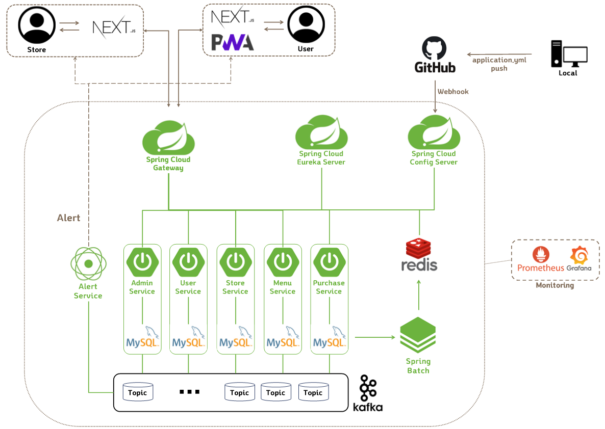
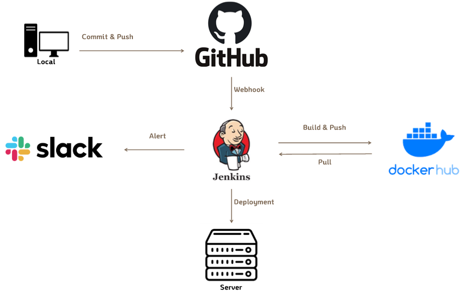

# Cafe Noctem Project

## ☕ Project

1. 카페 모바일 애플리케이션 주제의 프로젝트
2. 프로젝트 기간 : 2022.09.13 ~ 2022.11.11
3. Spring Boot 기반의 백엔드 서버
4. Java 11

## ☕ Demo

- User Service

  > User Service는 모바일로 접속하시는 것을 추천드립니다.
  > 
  > 위치 정보 이용에 동의해주시면 원활한 이용이 가능합니다.
  >
  > https://noctem-user1-fe.vercel.app/

  

- Admin Service

  > Admin Service는 PC로 접속하시는 것을 추천드립니다.
  > 
  > https://noctem-admin-fe.vercel.app/
  >
  > ※ Admin Service Test Account  
  > ID : noctem1  
  > PW : noctem

## ☕ Repository URL

#### FrontEnd

 

  FrontEnd Repository 상세보기
 

| Service | Github Repository | Description |
|--- |--- |--- |
| user | [user](https://github.com/saiani1/noctem-user1-FE) | 유저 페이지입니다. |
| admin | [admin](https://github.com/saiani1/noctem-admin-FE) | 매장 페이지입니다. |

  

#### BackEnd

 

  BackEnd Repository 상세보기
 

| Server | Github Repository | Description | Spring Boot | 
|--- |--- |--- |--- |
| eureka | [eureka](https://github.com/arotein/noctem-eureka-BE.git) | 각 서버들에 대해 Discovery, Registry 역할을 수행해주는 서버 | 2.7.4 |
| gateway | [gateway](https://github.com/arotein/noctem-gateway-BE.git) | 요청을 각 서버들로 라우팅시켜주는 게이트웨이 서버 | 2.7.4 |
| config | [config](https://github.com/arotein/noctem-config-server-BE.git) | 각 서버들의 설정 파일을 관리하고 적용해주는 config 서버 | 2.7.4 |
| batch | [batch](https://github.com/arotein/noctem-batch-BE.git) | 주기적으로 통계데이터를 처리하는 배치 서버 | 2.7.4 |
| alert | [alert](https://github.com/arotein/noctem-alert-BE.git) | SSE 알림기능 구현을 위한 알림 서버 | 2.7.5 |
| user | [user](https://github.com/arotein/noctem-user-BE.git) | 유저에 관한 서비스를 처리하는 서버 | 2.6.8 |
| store | [store](https://github.com/arotein/noctem-store-BE.git) | 매장에 관한 서비스를 처리하는 서버 | 2.6.8 |
| menu | [menu](https://github.com/arotein/noctem-menu-BE.git) | 메뉴에 관한 서비스를 처리하는 서버 | 2.7.4 |
| purchase | [purchase](https://github.com/arotein/noctem-purchase-BE.git) | 결제에 관한 서비스를 처리하는 서버 | 2.6.8 |
| admin | [admin](https://github.com/arotein/noctem-admin-BE.git) | 관리자에 관한 서비스를 처리하는 서버 | 2.6.8 |

  

## ☕ Architecture

### 특징

- MicroService Architecture
- Spring WebFlux로 SSE 알림 구현
- Spring Batch로 통계데이터 API 응답 속도 개선
- Kafka로 서비스간 비동기 통신
- 각 서버는 Docker로 컨테이너화시켜 배포
- Prometheus, Grafana로 서버 모니터링

## ☕ CI/CD

### 특징

- Docker 및 Jenkins를 이용하여 빌드/배포 자동화
- Slack 연동을 통해 팀원간 빌드/배포 상태 공유

## ☕ 사용 기술

### Frontend

</a>&nbsp;
</a>&nbsp;
</a>&nbsp;
</a>&nbsp;
</a>&nbsp;
</a>&nbsp;

### Backend

</a>&nbsp;
</a>&nbsp;
</a>&nbsp;
</a>&nbsp;
</a>&nbsp;
</a>&nbsp;
</a>&nbsp;

### DB

</a>&nbsp;
</a>&nbsp;

### Deployment

</a>&nbsp;
</a>&nbsp;
</a>&nbsp;

### Tools

</a>&nbsp;
</a>&nbsp;
</a>&nbsp;
</a>&nbsp;
</a>&nbsp;

&nbsp;
